# Hash Table Benchmark

This is yet another benchmark for evaluating hash tables(hash maps) with different hash functions in C++, attempting to 
evaluate the performance of the lookup, insertion, deletion, iteration, etc. on different data as comprehensively as possible.

## Before viewing the results

If one is familiar enough with the world of hash tables, he/she will know that even for a well-known and widely used 
hash table, there is a data distribution that it's not very good at. In other words, no hash table is 
the fastest on all datasets for all operations.

The best practice for selecting a hash table needs to consider the characteristics of the data and the proportion of 
operations, fit the actual needs and cooperate with the most suitable hash function.

This benchmark tries to use a concise and effective method to test the performance of different operations of the hash
table on some of the most common data distributions. But in fact, there must be a data distribution that is very
different from the data we use for testing, and different users have different requirements for different indicators.
Therefore, the best test method is to test in real applications.

## Methodology

### Test Items

We measure the combination of different hash tables with different hash functions. For each combination, we measured its 
insert, delete, query (including successful and failed queries), and iteration performance under different data. Below 
is a more detailed table of test items. Please note that in the following we will use "hash table" or "hash map" 
indiscriminately to refer to the same concept. 

| Index | Test items                                                               | Notes                                                                                                             |
|-------|--------------------------------------------------------------------------|-------------------------------------------------------------------------------------------------------------------|
| 1     | Insert with reserve                                                      | Call map.reserve(n) before insert n elements                                                                      |
| 2     | Insert without reserve                                                   | Insert n elements without prior reserve                                                                           |
| 3     | Erase and insert                                                         | Repeatedly do one erase after one insert, keep the map size constant                                              |
| 4     | Look up keys in the map                                                  | Repeatedly look up the elements that are in the map                                                               |
| 5     | Look up keys that are not in the map                                     | Repeatedly look up the elements that are not in the map                                                           |
| 6     | Look up keys with 50% probability in the map                             | Repeatedly look up the elements that have a 50% probability in the map                                            |
| 7     | Look up keys in the map with larger max_load_factor                      | Same as Test Item 4 except that the map is set a max_load_factor of 0.9 and rehashed before the lookup operations |
| 8     | Look up keys that are not in the map with larger max_load_factor         | Same as Test Item 5 except that the map is set a max_load_factor of 0.9 and rehashed before the lookup operations |
| 9     | Look up keys with 50% probability in the map with larger max_load_factor | Same as Test Item 6 except that the map is set a max_load_factor of 0.9 and rehashed before the lookup operations |
| 10    | Iterate the table                                                        | Iterate the whole table several times                                                                             |
| 11    | Insert and rehash time with larger max_load_factor                       | The average time used in insert and rehash to construct the time in Test Item 7,8,9                               |

As you may have noticed, several of the test items are set to test the query speed of hash tables with a larger upper limit on the load factor (the load factor is an important data indicator to measure how full the hash table is, max_load_factor is an API for maximum load factor in STL). This is because each hash table may have a different expansion strategy and max_load_factor, so even with the same number of elements, they will choose different load factors, which will cause them to occupy different memory space. The size of the memory space occupied greatly affects the lookup performance, so using a hash table with a smaller max_load_factor may have worse performance when looking up. In addition, if a user wants extreme lookup time, he probably needs to make the space used by the hash table as small as possible to reduce the cache miss rate. Then one of the things that can be done is to set a higher max_load_factor, and then rehash.

### Dataset

All the data used in the benchmark are randomly generated, the user can choose different seeds for the test data. We 
tested the performance of each hash table at different sizes from 32 to 10^7.

The tested keys consist of 64-bit integers of different distributions and strings of different lengths. The detailed 
test data is shown in the table below.

| Index | Key Type                                           | Value Type      | Notes                                                        |
| ----- | -------------------------------------------------- | --------------- | ------------------------------------------------------------ |
| 1     | uint64_t with several split bits masked            | uint64_t        | The keys have such characteristics: only some bits may be 1, and all other bits are 0. For test data of size n, at most ceil[log2(n)] fixed bits may be 1. e.g. If the key type is uint8_t (it is uint64_t in reality) and the test size is 7, the keys will be generated with the method `rng() & 0b10010001`. The distribution characteristics of such bits can relatively comprehensively examine whether hash tables and hash functions can handle keys that only have effective information in specific bit positions. |
| 2     | uint64_t, uniformly distributed in [0, UINT64_MAX] | uint64_t        | The keys follow a uniform distribution in the range [0, UINT64_MAX]. |
| 3     | uint64_t, bits in high position are masked out     | uint64_t        | The bits in the high position are set to 0. For test data of size n, at most ceil[log2(n)] fixed bits may be 1. For example, if the key type is uint8_t (uint64_t in reality) and the test size is 7, the keys will be generated with the method `rng() & 0b00000111` |
| 4     | uint64_t, bits in low position are masked out      | uint64_t        | The bits in the low position are set to 0. For test data of size n, at most ceil[log2(n)] fixed bits may be 1. For example, if the key type is uint8_t (uint64_t in reality) and the test size is 7, the keys will be generated with the method `rng() & 0b11100000` |
| 5     | uint64_t with several bits masked                  | 56 bytes struct | The keys are the same as the distribution of the data 1. The payload is a 56 bytes long struct, which makes the `sizeof(std::pair<key, value>)==64` |
| 6     | Small string with a max length of 12               | uint64_t        | The key type is a string with a maximum length of 12. Both length and characters are randomly generated. The Small String Optimization(SSO) technique may be taken by the compiler. |
| 7     | Small string with a fixed length of 12             | uint64_t        | The key type is a string with a fixed length of 12. The characters are randomly generated. The Small String Optimization(SSO) technique may be taken by the compiler. |
| 8     | Mid string with a max length of 56                 | uint64_t        | The key type is a string with a maximum length of 56. Both length and characters are randomly generated. |
| 9     | Mid string with a fixed length of 56               | uint64_t        | The key type is a string with a fixed length of 56. The characters are randomly generated. |

Different distributions within the range representable by uint64_t are chosen as keys. Uniformly distributed integers in 
the range of uint64_t are the easiest to generate with pseudo-random numbers, but it is rare in real situations. 
Real data distributions are often biased. And if a combination of hash function and hash table can only handle one 
distribution and cannot handle other distributions, this combination is not robust to unknown distributions. If the 
distribution of the data is known in advance, the user can pick the fastest and most stable hash table for that data.

## Build

### Requirements

OS: Linux, macOS, or Windows

Compiler: Only GCC and Clang have been tested; the compiler has to support C++17

Build Tool: CMake >= 3.10

### Steps

First, clone this repo to the machine, then update the submodules

```bash
cd hashtable-bench
git submodule update --init --recursive
```

Use CMake to make the targets

```bash
mkdir build
cd build
cmake .. -DCMAKE_BUILD_TYPE=Release # (default: -DBENCH_ONLY_INT=OFF -DBENCH_ONLY_STRING=OFF)
```

Use the python script provided to run all the tests in the benchmark

```bash
cd ../tools
python3 run_bench.py seed export_results_directory_path
```

The results of the tests will be in the format of `csv` files. You can use the jupyter notebook 
`tools/analyze_results.ipynb`  to parse and generate plots of the results.

## Features

- Support the hash tables with a seed hash function (which takes both a key and a seed as the function arguments) like
[Flash Perfect Hash](https://github.com/renzibei/fph-table).

- One can easily add new hash functions and hash maps.

- Data with different distributions, different characteristics, and different types are tested.
- Tested as many operations on hash tables as possible.
- Provides a convenient tool for visualizing test results.

## How to add a new hash function or hash table

One can follow the samples in `src/hashes/std_hash` and `src/maps/std_unordered_map`. If the new hash function or the 
hash map has a repo in the GitHub, you can add it as a submodule (put in `thirdparty/`) and then use CMake `addsubmodule` 
or just add the include directories.

After the new hash directory or hash map directory is added, run the CMake command to generate the build targets.

## Results

Here we show some of the test results. For complete test results, users can visualize the csv data using the tools we provide.

### Tested Hash functions and Hash maps

Below is the hash function list we tested

| Name                   | Type      | Notes                                                        | Link                                           |
| ---------------------- | --------- | ------------------------------------------------------------ | ---------------------------------------------- |
| std::hash              | Normal    | Implemented by compiler; identity hash is used for integer type in libc++ and libstdc++ |                                                |
| absl::hash             | Normal    | Implemented by google                                        | https://github.com/abseil/abseil-cpp           |
| robin_hood::hash       | Normal    | Similar to absl::hash                                        | https://github.com/martinus/robin-hood-hashing |
| xxHash_xxh3            | Normal    | Originally designed for string; We use identity hash for integer type | https://github.com/Cyan4973/xxHash             |
| fph::SimpleSeedHash    | Seed Hash | Use identity hash for integer type; The hash function for string is the same as robin_hood::hash | https://github.com/renzibei/fph-table          |
| fph::MixSeedHash       | Seed Hash | A little more complicated than Identity hash for integer type; Same hash function for string as robin_hood::hash | https://github.com/renzibei/fph-table          |
| fph::StrongxSeedHash   | Seed Hash | More compilicated than fph::MixSeedHash for integer type; Same hash function for string as robin_hood::hash | https://github.com/renzibei/fph-table          |
| xxHash_xx3 (with seed) | Seed Hash | Originally designed for string; We use identity hash for integer type | https://github.com/Cyan4973/xxHash             |

The following table lists the hash tables we tested, some of these hash tables rely on a "good" hash function to work 
properly, which can generate hash values that are as uniformly distributed as possible for unbalanced keys. If a hash 
function that does not have such property (e.g. identity hash) is used, then the performance of these hash tables may 
drop drastically.

The implication here is that a good hash function tends to be more complex than the simplest hash function (the 
equivalent hash), requiring more instructions to complete the computation. So a hash table that does not rely on a good 
hash function is likely to be faster when the amount of data is small.

| Name                 | Notes                                                        | Link                                        |
| -------------------- | ------------------------------------------------------------ | ------------------------------------------- |
| std::unordered_map   | Implemented by the stl library; Does not require a good hash function |                                             |
| ska::flat_hash_map   | Fast in small size; Memory overhead: sizeof(alignof(size_t)) per element ; Does not require a good hash function | https://github.com/skarupke/flat_hash_map   |
| ska::bytell_hash_map | A little slower than ska::flat_hash_map but one byte per element memory overhead; Does not require a good hash function | https://github.com/skarupke/flat_hash_map   |
| absl::flat_hash_map  | Use SIMD and metadata; Ultra-fast when looking up keys that are not in the map; one byte per element memory overhead; Require a good hash function | https://abseil.io/blog/20180927-swisstables |
| absl::node_hash_map  | Slower than absl::flat_hash_map but does not invalidate the pointer after rehash; Require a good hash function | https://github.com/abseil/abseil-cpp        |
| tsl::robin_map       | Fast in small size; Large memory overhead; Require a good hash function | https://github.com/Tessil/robin-map         |
| fph::DynamicFphMap   | A dynamic perfect hash table; Ultra-fast in lookup but slow in insert; 2~8 bits per element memory overhead; Does not require a good hash function, require a seed hash function | https://github.com/renzibei/fph-table       |

If too much time is spent in a test, we will count it as the timeout and set the time as zero and that data point won't be plotted.

### Test Platform

Platform 1: AMD 3990x base 2.9 GHz, turbo boost 4.2 GHz; 3200 MHz DDR4 RAM; Ubuntu 20.04; gcc 10.2.0; x86-64;

Platform 2: M1 Max Macbook Pro 16 inch, 2021; 64 GB LPDDR5 RAM; macOS 12.1; clang 13.0.0; arm64;

### <K,V>: <uint64_t with several split bits masked, uint64_t>

#### Look up keys in the map with large max_load_factor

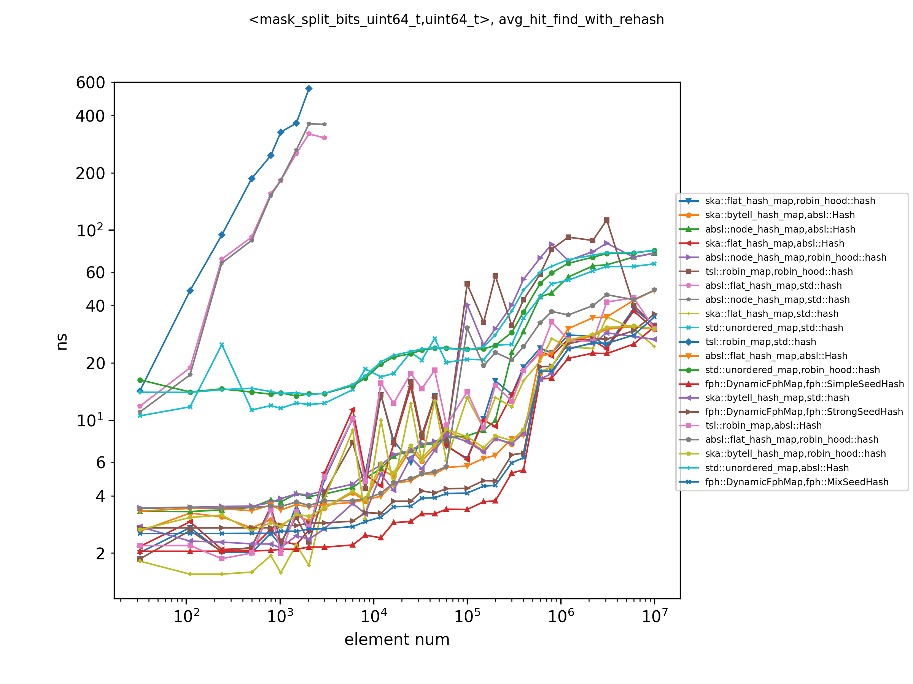

<center>Figure 1: Look up keys in the map with 0.9 max_load_factor, tested in AMD 3990x</center>


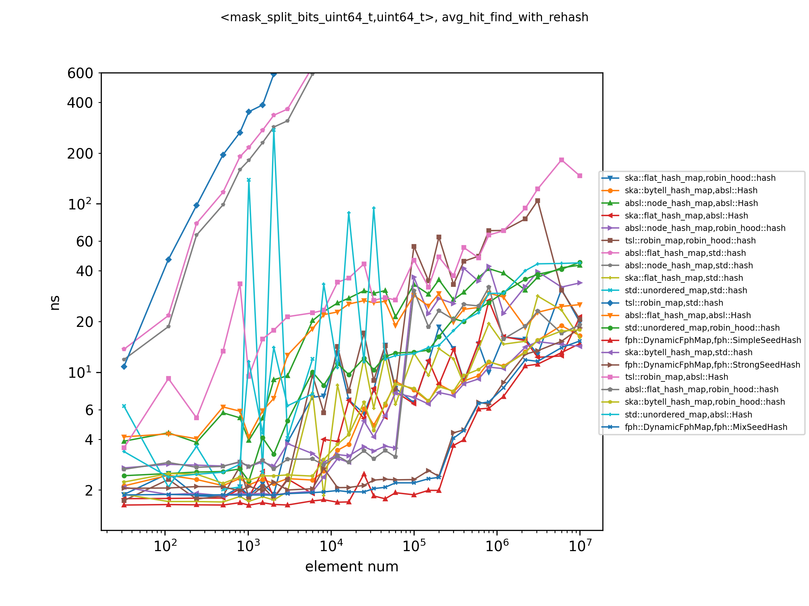 

<center>Figure 2: Look up keys in the map with 0.9 max_load_factor, tested in Apple M1 Max</center>

#### Lookup keys in the map with default max_load_factor

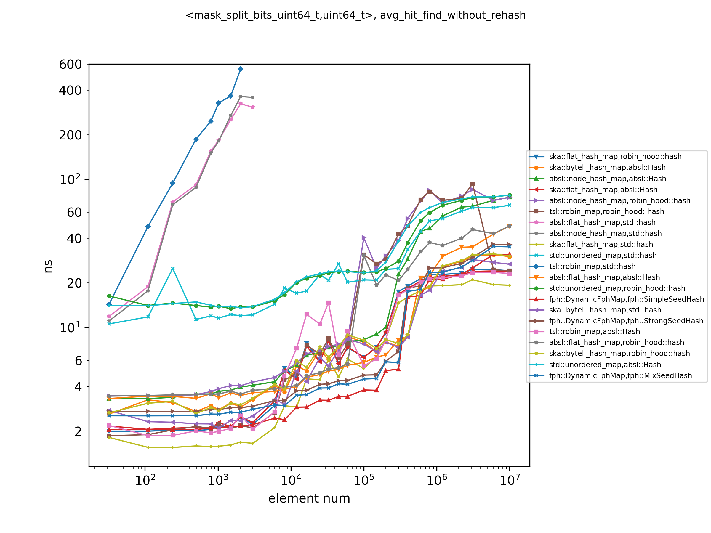

<center>Figure 3: Look up keys in the map with default max_load_factor, tested in AMD 3990x</center>

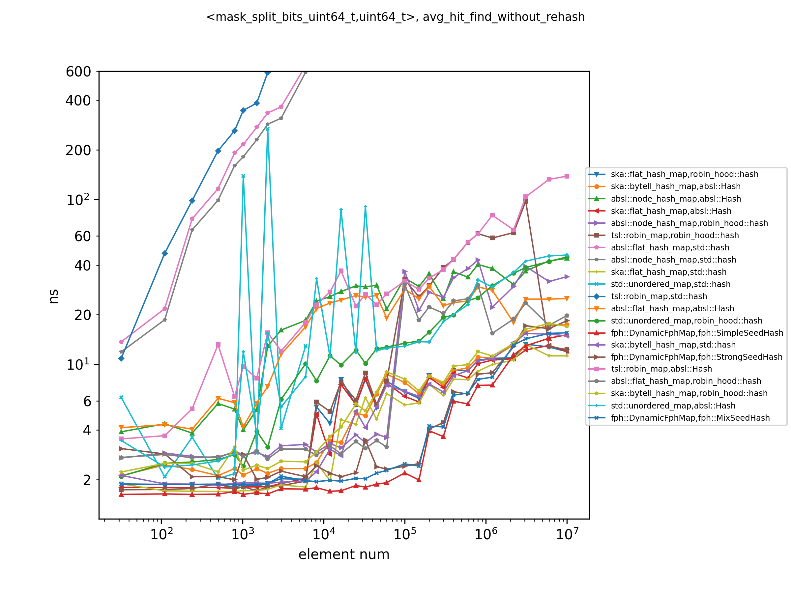

<center>Figure 4: Look up keys in the map with default max_load_factor, tested in Apple M1 Max</center>

#### Look up keys that are not in the map with large max_load_factor

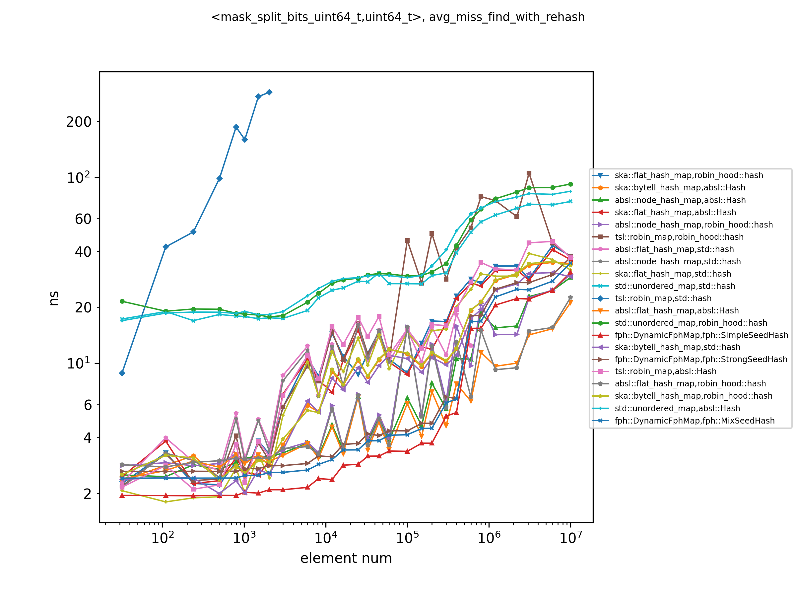

<center>Figure 5: Look up keys that are not in the map with 0.9 max_load_factor, tested in AMD 3990x</center>


<center>Figure 6: Look up keys that are not in the map with 0.9 max_load_factor, tested in Apple M1 Max</center>

#### Analysis of lookup integer keys

The first thing we need to be clear about is that the lookup performance of the hash table is directly related to the 
cache hit rate. So one can see clearly from figure 1 that in x86-64 architecture, the performance of the query is 
roughly divided into four levels by the number of elements: 

1. Elements can be fully loaded into the L1 cache; When sizeof(value_type) is 16 bytes and the L1 data cache is 32 KB, 
there can be about 2048 elements at most
2. Elements can be fully loaded into the L2 cache; When sizeof(value_type) is 16 bytes and the L2 cache is 512 KB, 
there can be about 32768 elements at most
3. Elements can be fully loaded into the L3 cache; When sizeof(value_type) is 16 bytes and the L2 cache is 16 MB, 
there can be about 10^6 elements at most
4. A lot of reads from RAM are bound to occur; When L3 cache can not fully contain the elements, here is roughly when 
there are more than 10^6 elements

In addition to the cache miss, TLB miss is also a major factor affecting the lookup speed of hash tables. Zen2 has 
64 L1 TLB entries and 2048 L2 TLB entries. This means if a 4KB page size is used, there will be a lot of L1 TLB miss 
when the number of elements is larger than 16384 and L2 TLB miss when the number is larger than 524288. If huge pages 
are used, there can be far less TLB miss. On macOS using m1 max, a 16 KB page size is used by default. So the penalty 
caused by TLB miss is much smaller than the default setting of the zen2 platform.

When the task is to find an element in a hash table, from figure 1 and figure 2, we can see that in x86-64 
(more specifically, tested in zen2) architecture, with a large max_load_factor, when the size of elements is smaller 
than 1000,  `ska::flat_hash_map` with `std::hash` is the fastest combination of hash tables. When the number of elements 
exceeds 1000, `fph::DynamicFphMap` with `fph::SimpleSeedHash` is the fastest in lookup.

In arm64 (tested in Apple Silicon) architecture, `fph::DynamicFphMap` with `fph::SimpleSeedHash` has the fastest 
lookup speed regardless of the number of elements. `ska::flat_hash_map` with `std::hash` are also very competitive with 
less than 2000 elements.

In addition, we can find that for those hash tables that require the quality of the hash function, the lookup performance 
on this data distribution is poor when using `std::hash`. By contrast, for those hash tables that do not rely on good 
hash functions (such as `ska::flat_hash_map` and `fph::DynamicFphMap`), simpler hash functions (such as `std::hash` and 
`fph::SimpleSeedHash`) can make their lookup operations faster because less time is spent on hash functions.

According to our observations, the current implementation of `absl::hash` on the arm64 architecture is not quite good as 
it cannot make good use of the information of the higher bits of the integer key value (which is more obvious on the 
datasets where the lower bits of keys are masked out.).

Comparing figure 1 and figure 3, we can also see that some hash tables with a larger load factor have better lookup 
performance, such as DynamicFphMap, because of less memory usage and low cache miss rate. Some hash tables, such as 
ska::flat_hash_map and tsl::robin_map, perform worse for a larger load factor, possibly because the collision rate 
becomes higher.

Observing Figure 5 and Figure 6, it can be concluded that for looking up elements that are not in the hash table, when 
the number of elements is not very large (more specifically, all elements can fit in the L3 cache), the 
`fph::DynamicFphMap` has the fastest lookup speed; and when the number of elements becomes larger, 
`absl::flat_hash_map` has the fastest lookup speed. `absl::flat_hash_map` can have such high query performance in this 
scenario is understandable, because it uses a metadata table of 1-byte per element and SIMD instructions, which means 
that it can determine whether the key to be looked up is contained in a dozen possible positions. The 1 byte metadata 
per element needs much smaller space to store than the complete element array, so the cache hit rate is much higher than 
other hash tables.

#### Insert with reserve


<center>Figure 7: Insert keys into the map with a prior reserve, tested in AMD 3990x</center>

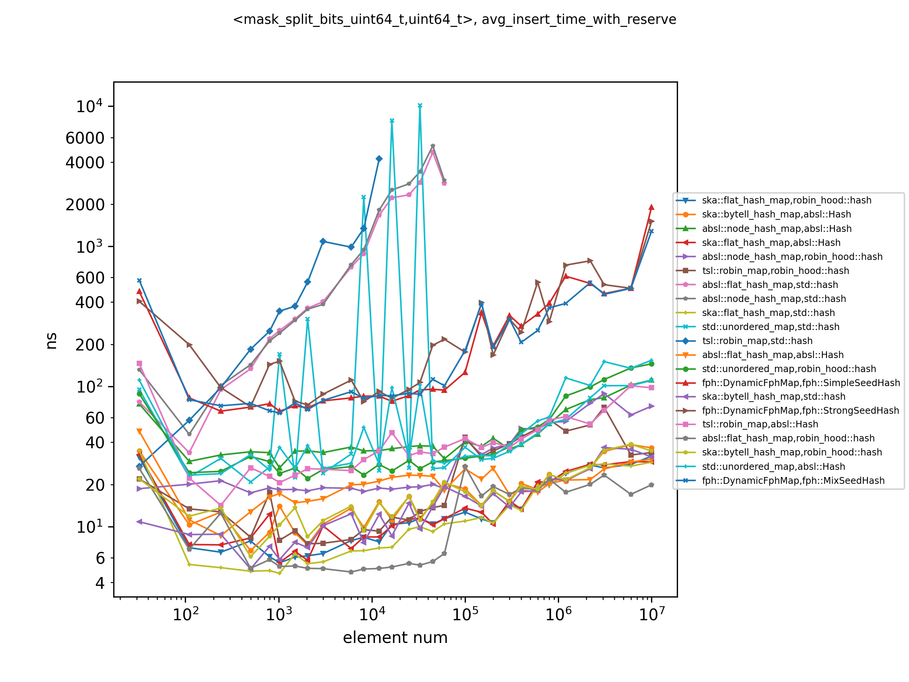

<center>Figure 8: Insert keys into the map with a prior reserve, tested in Apple M1 Max</center>

From Figure 7 and Figure 8, it can be found that hash `ska::flat_hash_map` with `std::hash` has excellent performance 
when the number of elements is small. When the number of elements becomes too large to fit in the L2 cache, 
`absl::flat_hash_map` has the highest performance with a suitable hash function (such as hash `absl::hash` in x86-64 
or `robin_hood::hash`).

#### Erase and insert


<center>Figure 9: Erase and Insert keys, tested in AMD 3990x</center>

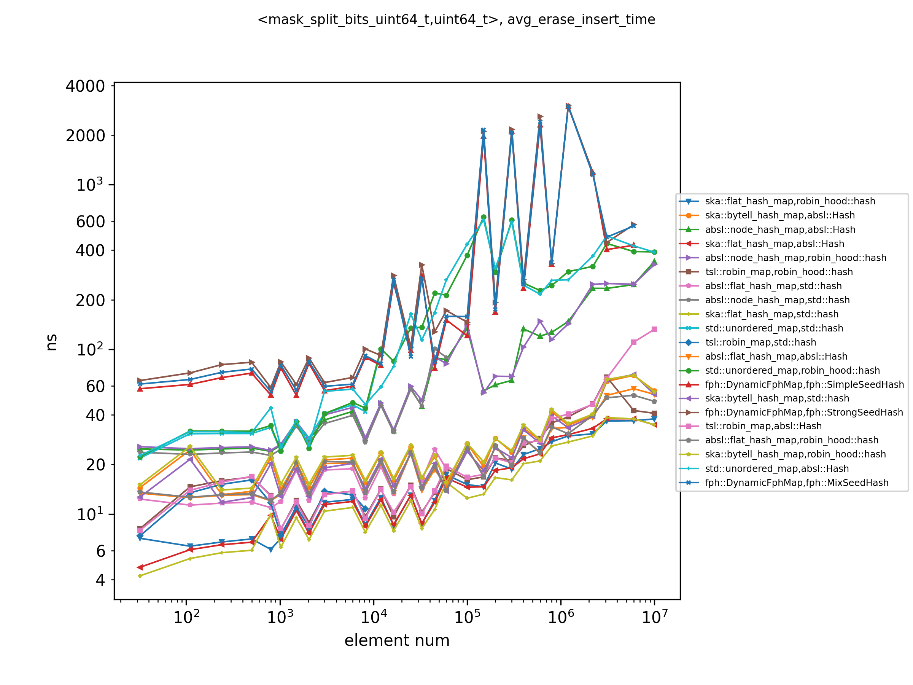

<center>Figure 10: Erase and Insert keys, tested in Apple M1 Max</center>

In this test, `ska::flat_hash_map` has almost the best erase and insert performance regardless of the number of 
elements. `tsl::robin_map` performs almost as well with more than 1000 elements.

#### Iterate

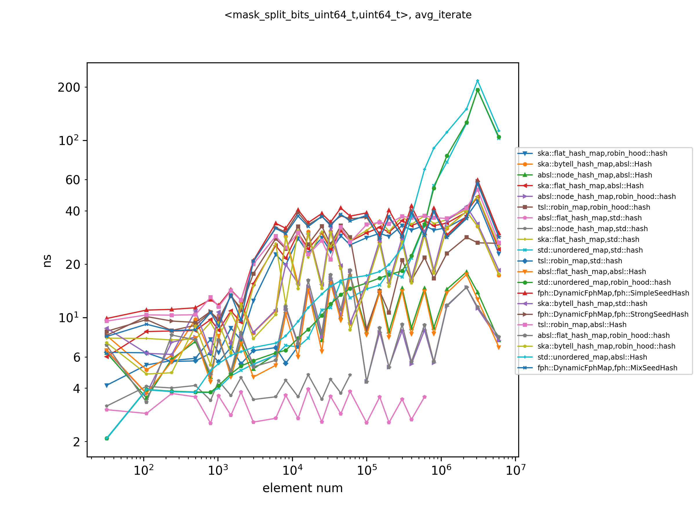

<center>Figure 11: Iterate the table, tested in AMD 3990x</center>

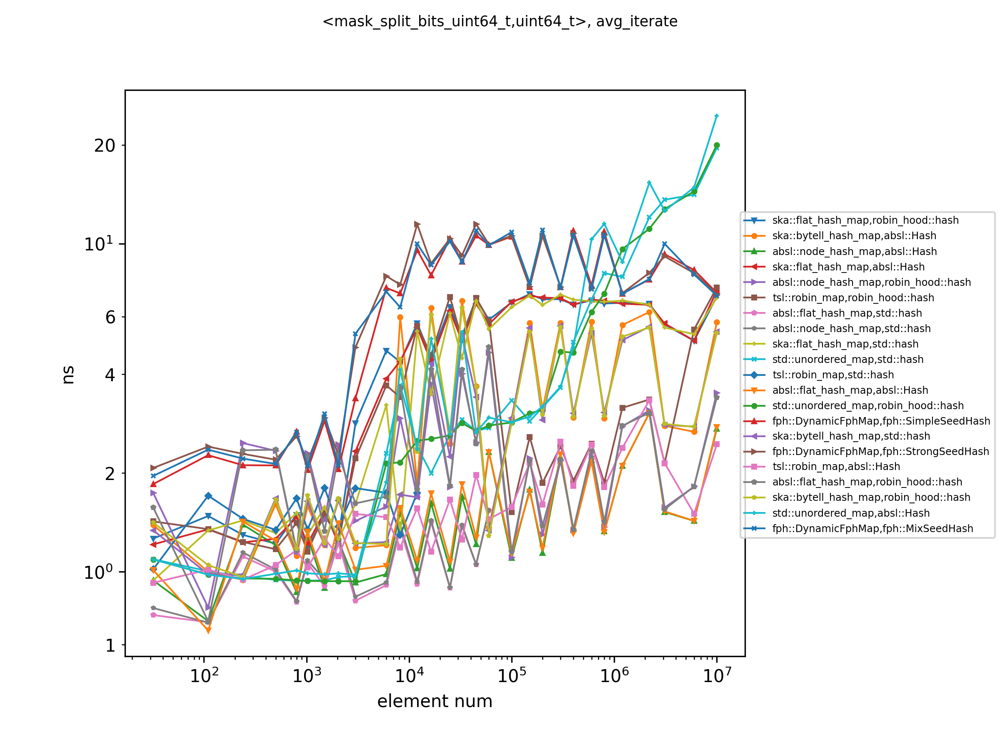

<center>Figure 12: Iterate the table, tested in Apple M1 Max</center>

Although the combination of `absl::flat_hash_map` and `absl::node_hash_map` with `std::hash` iterate very fast when 
the amount of data is small, it can be seen that they have no test results when the amount of data is large. This is 
because these combinations insert elements so slowly that they time out. So they shouldn't be included in the statistics 
of the fastest iterating hash table. 

When the amount of data is small, the iteration speed of `std::unordered_map` is unexpectedly fast. And when the amount 
of data begins to increase, `absl::flat_hash_map` and `absl::node_hash_map` become the fastest iterative hash maps.

### <K,V>: <uint64_t with several split bits masked, 56 bytes struct>

Due to space limitations, comprehensive results are not presented in this document.

#### Look up keys in the map with large max_load_factor

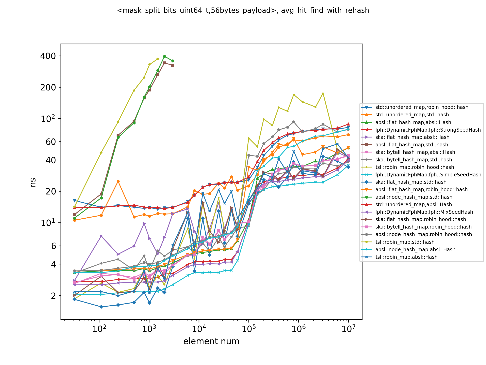

<center>Figure 13: Look up keys in the map with 0.9 max_load_factor, tested in AMD 3990x</center>

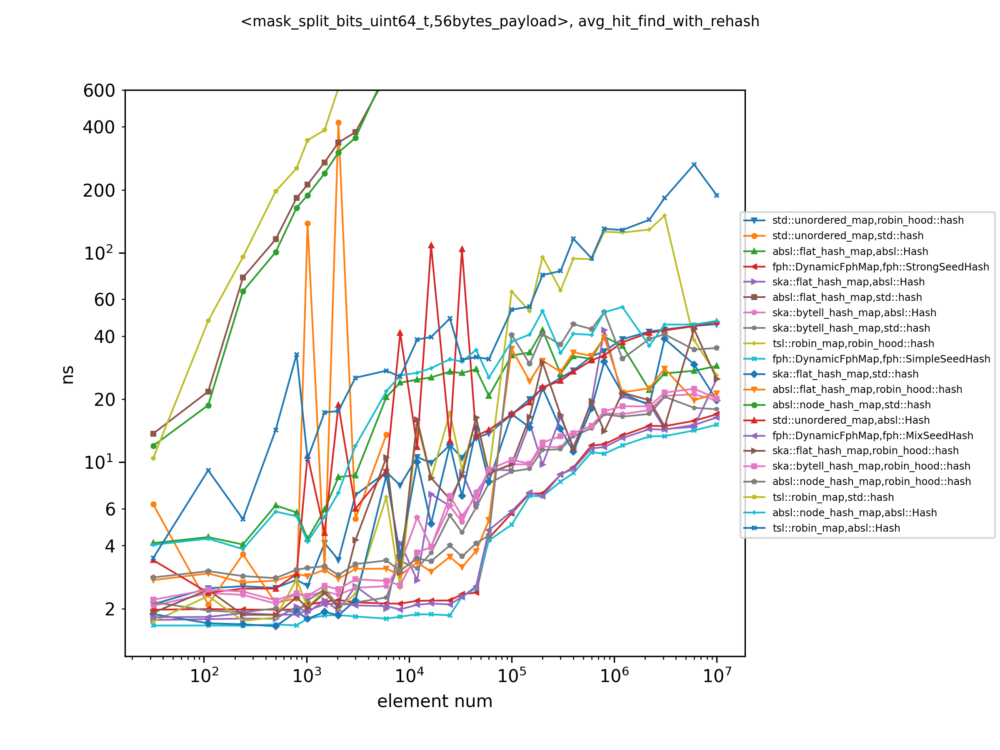

<center>Figure 14: Look up keys in the map with 0.9 max_load_factor, tested in Apple M1 Max</center>

We can see that the relative performance of the hash tables is similar when using uint64_t as the payload. 
`ska::flat_hash_map` is still excellent when the number of elements is small, and the lookup performance of 
`fph::DynamicFphMap` is the best when the number of elements is large.

Since the size of a single element becomes larger, it is easier for the cache hit rate to drop due to the increase in 
the number of elements.

### <K,V>: <Small string with max length of 12, uint64_t>

#### Look up keys in the map with large max_load_factor

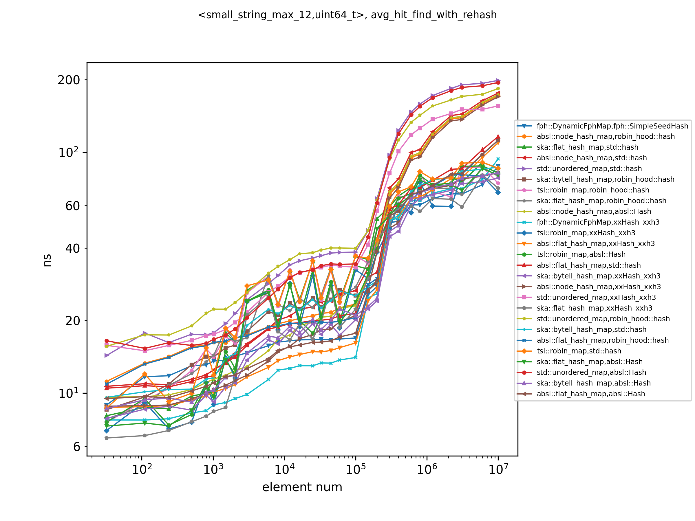

<center>Figure 15: Look up keys in the map with 0.9 max_load_factor, tested in AMD 3990x</center>

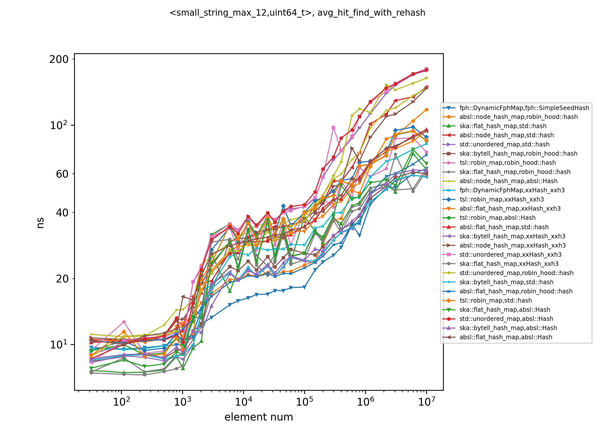

<center>Figure 16: Look up keys in the map with 0.9 max_load_factor, tested in Apple M1 Max</center>

Comparing different hash functions, it can be found that on the x86-64 platform, `xxHash_xxh3` is almost the fastest on 
each data scale for this dataset. By contrast, `robin_hood::hash` is faster on the arm64 platform.

tWhen the amount of data is very small or very large, `ska::flat_hash_map` is the fastest hash map for lookup. And when 
the data size is medium, `fph::DynamicFphMap` has the best query performance.

This dataset is what we consider the least representative because there are too many random parameters for strings of 
indeterminate length. At least compared to fixed-length strings, the distribution characteristics of the length of a 
string can only be determined by specific problems. Names, English words, place names, stock codes, identity numbers, 
base64 encoding of md5, etc. all have different length distributions. Therefore, the difference between the datasets 
whose keys are strings is too great. If there is a need, users should test it against their actual data.

The lengths of the strings here are roughly uniformly distributed between approximately 1 and the maximum length. It is 
said to be "roughly" because it is not completely uniform. The shorter the length, the less the selection space of the 
string. For example, if the dictionary has only 26 letters, a string of 1 length can only hold 26 combinations. This 
results in more strings with longer lengths than strings with shorter lengths.

### <K,V>: <Small string with fixed length of 12, uint64_t>

#### Look up keys in the map with large max_load_factor

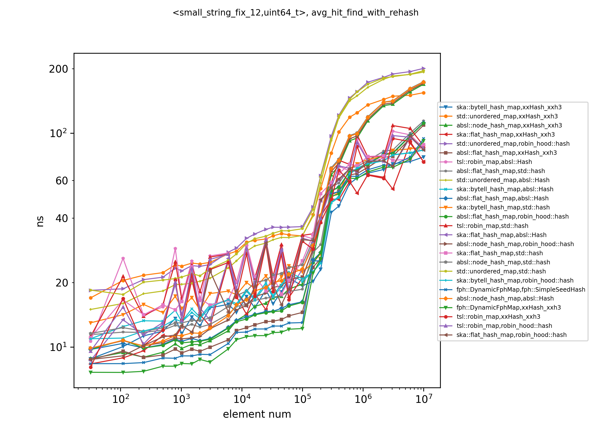

<center>Figure 17: Look up keys in the map with 0.9 max_load_factor, tested in AMD 3990x</center>

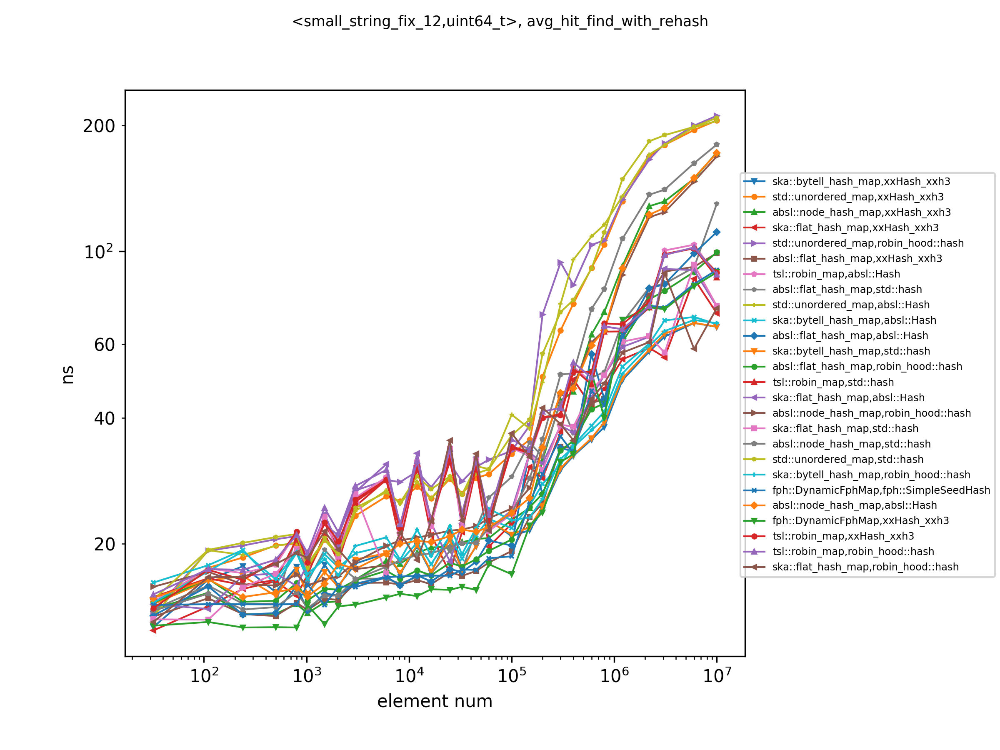

<center>Figure 18: Look up keys in the map with 0.9 max_load_factor, tested in Apple M1 Max</center>

For strings of fixed length 12, `fph::DynamicFphMap` is the fastest in lookup operations for almost any number of 
elements on the x86-64 platform. `ska::flat_hash_map` and `ska::bytell_hash_map` also have fairly good lookup speed 
when the number of elements is large. On the arm64 platform, `ska::bytell_hash_map` dominates test results with a very 
large number of elements.

For the hash functions participating in the test, hash `xxHash_xxh3` can make the hash table play the fastest lookup 
performance. But does this mean that `xxHash_xxh3` is the fastest for a fixed 12-byte string? It's not that simple. 
In general, hash functions designed for byte arrays (strings) need to consider various odd byte lengths and various 
memory alignment lengths. Therefore, these hash functions generally use unaligned fetch methods to avoid undefined 
behavior. And the branches and non-trivial instructions brought about by these considerations can make the hash function 
slower. If we already know that the length of the string is a fixed 12 bytes (or other bytes) and the memory is aligned 
to machine word width, we can design a faster hash function.

For example, below is a hash function with seed for 12 bytes data. This is not a good hash function in the usual sense, 
but it is a very fast and good enough hash function for `fph::DynamicFphMap`. This function assumes that the starting 
address of the input data is 8-byte aligned, and the data length is fixed at 12 bytes, so no dirty special handling is 
required.

```c++
inline uint64_t Hash12Bytes(const void* src, size_t seed) {
    uint64_t v1 = *reinterpret_cast<const uint64_t*>(src);
    uint32_t v2 = *reinterpret_cast<const uint32_t*>(((const uint64_t*)src) + 1);
    v1 *= seed;
    v1 ^= v2;
    return v1;
 }
```

Figure 19 compares the lookup performance of this hash function and `xxHash_xxh3` when used with `fph::DynamicFphMap`. 

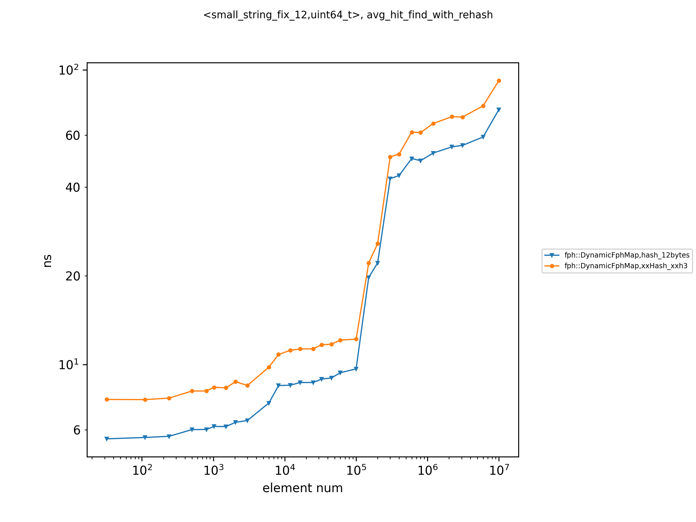

<center>Figure 19: Look up keys in the map with 0.9 max_load_factor, tested in AMD 3990x</center>

Figure 19 clearly shows that the specially designed hash function for 12bytes is faster  than the more general hash 
function `xxHash_xxh3` when used with `fph::DynamicFphMap` at any data scale.

Therefore, if the user is looking for the ultimate performance, then when the key is a short fixed-length string, an 
optimized hash function should be provided for the hash table. 

### <K,V>: <Mid string with max length of 56, uint64_t>

#### Look up keys in the map with large max_load_factor

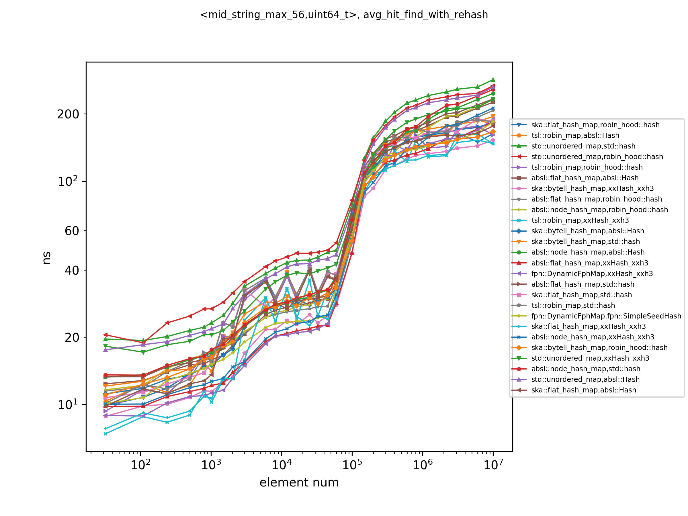

<center>Figure 20: Look up keys in the map with 0.9 max_load_factor, tested in AMD 3990x</center>

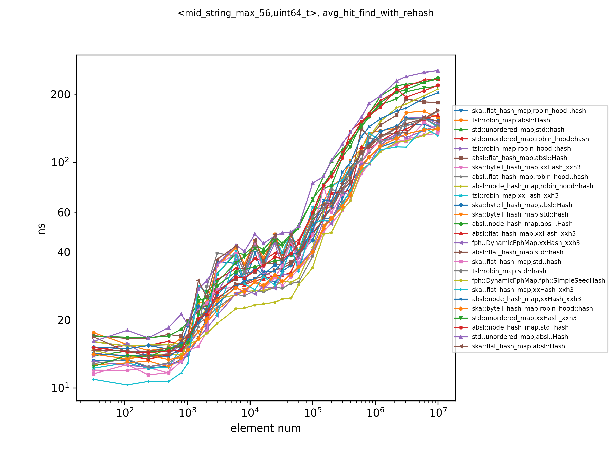

<center>Figure 21: Look up keys in the map with 0.9 max_load_factor, tested in Apple M1 Max</center>

It can be found from the test results that hash `xxHash_xxh3` performs better on the x86-64 platform on the data 
tested here, while hash `robin_hood::hash` is better on the arm64 platform.

When the amount of data is small or is very large, both hash `ska::flat_hash_map` and `tsl::robin_map` have the fastest 
lookup speed (`tsl::robin_map` does not perform so well on the arm64 platform).

On the x86-64 platform, the lookup speed of `fph::DynamicFphMap` and `absl::flat_hash_map` is the fastest when the 
amount of data is moderate. On the arm64 platform, `fph::DynamicFphMap` has very extraordinary query performance when 
the amount of data is moderate and very large. `ska::bytell_hash_map` has a competitive performance on all scales of 
data on both platforms.

Again, like the string dataset with a maximum length of 12 bytes, this random-length dataset is very unrepresentative. 
The length distribution of strings in different application scenarios is completely different, and more specific data 
sets should be tested to obtain accurate results.

### <K,V>: <Mid string with fixed length of 56, uint64_t>

#### Look up keys in the map with large max_load_factor


<center>Figure 22: Look up keys in the map with 0.9 max_load_factor, tested in AMD 3990x</center>


<center>Figure 23: Look up keys in the map with 0.9 max_load_factor, tested in Apple M1 Max</center>

For this dataset, lookup performance again shows somewhat different results on two platforms with different instruction 
sets.

On x86-64 platforms, `xxHash_xxh3` is the fastest hash function that works with a hash table. `fph::DynamicFphMap` has 
the fastest lookup speed when there is little data. `absl::flat_hash_map` has excellent lookup performance no matter 
what data size, especially when the amount of data is large.

On the arm64 platform,  no hash function is the fastest with all hash tables. `xxHash_xxh3` and `fph::SimpleSeedHash`
(which is almost the same as `robin_hood::hash` when key type is string) have their advantageous data sizes when paired 
with different hash tables. `fph::DynamicFphMap` combined with `xxHash_xxh3` has the fastest lookup performance on 
smaller data sizes.  `fph::DynamicFphMap` using `fph::SimpleSeedHash` and `absl::flat_hash_map` using `xxHash_xxh3`
have superior lookup performance on all data sizes.  The combination of `fph::DynamicFphMap` and  `fph::SimpleSeedHash` 
is the fastest especially when the data size is large.

## Conclusion

Reviewing our test results, we can find that the performance is different for different key types, different operation 
types, different data scales, different data distributions, and different machine platforms. 

The results we show are only for ideal test environments on some common data distributions and common machine platforms. 
The reality is often much more complicated. Therefore, if users want to choose the most suitable hash table and hash 
function, they can refer to the results of this benchmark to heuristically filter some candidates, and then use their 
own test data to test what is most suitable for the specific environment.

Although we've left out a lot of testing, there are still quite a few diagrams in this document and a lot more that 
aren't shown. If necessary, you can go to the "results" directory to view the csv data and use the visualization script 
we provide to plot.

Time to make some suggestions. If the developer doesn't care about the performance of the hash table at all, then the 
hash table in the STL is sufficient. If performance is critical, then some choices need to be made. 

Generally speaking, from the results we have, we first need to pick a pair of hash function and hash table. For example, 
for integer data, `ska::flat_hash_map` which is not very demanding on hash functions is almost always best for 
`std::hash`, which is computationally fast, and similarly, `fph::DynamicFphMap` is almost always best for 
`fph::SimpleSeedHash`. And if it is other hash tables, it is more appropriate to cooperate with a real hash function 
such as `robin_hood::hash`. If it is a string type of key, the `xxHash_xxh3` is often the fastest and good enough on 
the x86-64 platform, while the performance of the `robin_hood::hash` on the arm64 platform is better. 

In most cases, if the data size is small, `ska::flat_hash_map` can perform very well. And if the data size becomes 
larger, there are more situations to consider.

If you need the comprehensive performance of insert, find, delete, etc., then you can't choose `fph::DynamicFphMap`, 
which is very slow to insert. You should choose other Hash Tables. And if you value lookups very much and insert and 
delete operations less, then `fph::DynamicFphMap` has the best performance for most data. Again, make decisions based 
on specific data and specific tests.
